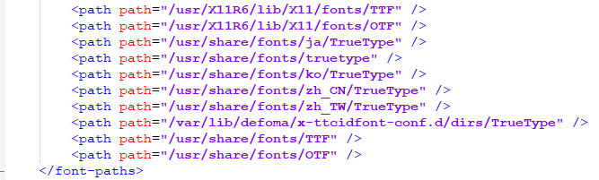

Движок для печатных форм
========================================
Проект предназначен для локального создания печатных форм BIRT

Перед использованием проекта необходимо произвести его настройку.

Проект предполагается использовать с Intellij Idea Community Edition.

Настройка
-----------------

**Шаг 1.** Выгрузить проект _gelicon-core-reports_ в какой-нибудь каталог командой:

```
git clone http://git.srv.gelicon.biz/gelicon-core/reports
```

**Шаг 2.** Скачать из интернета https://download.eclipse.org/birt/downloads/drops/R-R1-4.8.0-201806261756/

Распаковать в какой-нибудь каталог, например в d:\java\birtruntime\
и добавить в переменную среды CLASSPATH значение
D:\java\birtruntime\ReportEngine\lib

**Шаг 3.** Открыть в Intellij Idea CE файл reports\pom.xml как проект


**Шаг 4.** Установка Maven

Скачать файл apache-maven-3.8.1-bin.zip из 

http://maven.apache.org/download.cgi

распаковать его где-нибудь, например, так


**Шаг 5.** Прочие настройки

В файле build.cmd поправить вызов команды сборки
вместо 
```
call C:\Java\maven\bin\mvn clean package
```
написать
```
SET JAVA_HOME=D:\java\jdk-11
call D:\java\apache-maven-3.8.1\bin\mvn.cmd clean package
```
Здесь "D:\java\apache-maven-3.8.1" - папка, куда установлен Maven на предыдущем шаге

Проверка версии Maven командой
```
mvn -version
```

Настройка
-----------------
в Intellij Idea CE выполнить пункт меню Build-Build Project


Сборка и запуск
-----------------

Команда 
```
build.cmd 
```

соберет и ассемблирует отчеты-модули в единственный пакет `assembly\target\reports.jar`


Все зависимости (например, BIRT) будут собраны в каталоге `assembly\target\lib`


на который reports.jar будет настроен.
Таким образом, переносить lib и reports.jar в дистрибутив нужно вместе. 

Пример файла `build.cmd` лежит в папке `doc`. Его необходимо поместить в корневую папку проекта: `report/build.cmd`

При запуске `gelicon-core` будет искать reports.jar в своем каталоге lib. Очевидно, 
что библиотек, содержащих печатные формы может быть сколько угодно. Все они должны
быть скопированы в lib. Загрузчик `gelicon-core` будет сканировать этот каталог и  
регистрировать все печатные формы найденные в нем. 

Например, для кастомизации 
отчетов для определенного заказчика будет создана своя библиотека печатных форм, 
куда могут быть скопированы формы требующие кастомизации и разработаны новые формы.   

При запуске `gelicon-core` из IDE необходимо установить зависимость от reports.jar. 
Как это сделать описано в файле `readme.md` проекта `gelicon-core`       

**Внимание!** Не пытайтесь ассемблировать `reports.jar` вместе с зависимостями. Не будет работать 
из-за особенностей BIRT  

Создание новой печатной формы(отчета)
-----------------

1. В Idea создать новый модуль внутри коревого модуля reports


Рекомендуемое имя модуля **`r<Код печатной формы>`**


2. Включите модуль в зависимости модуля assembly. То есть внутри `assembly/pom.xml`
найдите тэг `<dependencies>` и добавьте в него

    ```xml
        <dependency>
            <groupId>biz.gelicon</groupId>
            <artifactId>Имя модуля</artifactId>
            <version>0.0.1-SNAPSHOT</version>
        </dependency>
    ```
3. Создайте в нем пакет `biz.gelicon.core.reports` или с иным названием.

4. Создайте в нем класс-регистратор печатной формы. Рекомендуемое название 
ReportService<Код формы>. Данные класс должен реализовывать интерфейс `ReportService` и 
быть аннотирован `@ReportProvider`.  
Пример:
    ```java
    @ReportProvider
    public class ReportService0114 implements ReportService {
       
    }
    ```

5. Сам шаблон печатной формы (Например, в случае с BIRT это *.rptdesign) должен 
быть размещен в ресурсах. Каталог `src/main/resources/reports` 


Соединение с БД
-----------------

1. (BIRT) В печатной форме нужно создать `DataSource` с параметрами тестовой БД 
(на котрой предполагается разрабатывать и тестировать отчет )

2. В параметре Jndi-Name нужно указать `java:comp/env/jdbc/gelicon-core-datasource`.
Этот источник данных будет предоставлен отчету, когда он будет запущен 
из продуктивной среды.


Внимание!
-----------------
1. Никаких соединений из reports не допускается. Все работа с БД 
только из печатных форм          

Настройка шрифтов на сервере Linux
-----------------
**Шаг 1.** Установка шрифтов в Linux 

Установка стандартных шрифтов от Microsoft 
```
sudo apt-get install msttcorefonts
```
или
```
sudo apt install ttf-mscorefonts-installer
```
Пакет содержит такие шрифты, как `Andale Mono, Arial, Arial Black, Comic Sans MS, Courier New, Georgia, Impact, Times New Roman, Trebuchet, Verdana, и Webdings`

**Шаг 2.** Пути файлов шрифтов BIRT по умолчанию 
Посмотреть в jar-фвйле `reports\lib\org.eclipse.birt.runtime_4.8.0-20180626-4.8.0.jar` в файле `fontsConfig.xml` 
в разделе `<font-paths>` пути, где BIRT ищет файлы. Выгядит примерно так:

и скопировать из папки `/usr/share/fonts/truetype/msttcorefonts` файлы шрифтов в какую-нибудь указанную там папку, например, в `/usr/share/fonts/TTF`.
Вложенные папки не допускаются!
После этого можно использовать в отчетах эти шрифты. Требуется перезапуск сервера `gelicon-core`.

**Шаг 3.** Установка дополнительных шрифтов
Скачайте из Интернета любые TrueType шрифты и положите их в любую папку, указанную в файле `fontsConfig.xml`.
Обязательно используйте папки, прописанные в файле `/etc/fonts/fonts.conf`.
Лучше всего используйте папку  `/usr/share/fonts/TTF`. Вложенности папок не допускаются.
Шрифты необходимо зарегистрировать в системе Linux. Для этого выполните команду
```
fc-cache -f -v
```
если не установлена утилита - установить
```
sudo apt-get install fontconfig
```

Проверить, что шрифты готовы
```
fc-list | grep "Calibri"
```
Требуется перезапуск сервера `gelicon-core`.

**Шаг 4.** Сосдание своего конфигурационного файла шрифтов для BIRT
Не использовать этот способ
Выполнить Шаг 3. При этом, допускается создание папок со скачанными шрифтами в лубой папке, указанной в файле `/etc/fonts/fonts.conf`.
Возможна вложенность папок.
Создать файл `fontsConfigGelicon.xml` следующего содержания
```
<?xml version="1.0" encoding="UTF-8"?>
<font>
	<font-paths>
		<path path="/usr/share/fonts/gelicon/Calibri" />
	</font-paths>
</font>
```
и положить его на сервере Linux по следующему пути:
`/usr/share/fonts/gelicon/fontsConfigGelicon.xml`
Строчек с путями может быть несколько. Они должны указывать на папки шрифтов, без вложенностей
В указанные в этом файле пути положить скачанные из Интернета файлы шрифтов.
Требуется перезапуск сервера `gelicon-core`.

Настройка русской локали на сервере Linux
-----------------
Проверяем, доступна ли русская локаль в системе и её корректное название:
```
locale -a | grep ru
```
Если результат пустой - установим
```
dpkg-reconfigure locales
```
В появившейся форме ищем локаль ru_RU.UTF-8 и отмечаем её нажатием пробелом, в результате перед этой локалью появится звёздочка.
Затем нажимаем Enter и переходим к следующему шагу.

Следующий шаг – выбор локали по умолчанию. Выбираем русскую локаль из списка и нажимаем Enter.

Открываем текстовым редактором файл /etc/default/locale
```
nano /etc/default/locale
```
Заменяем его содержимое на:
```
LANGUAGE=ru_RU:ru
LANG=ru_RU.UTF-8
```

Перезагружаем сервер Linux
